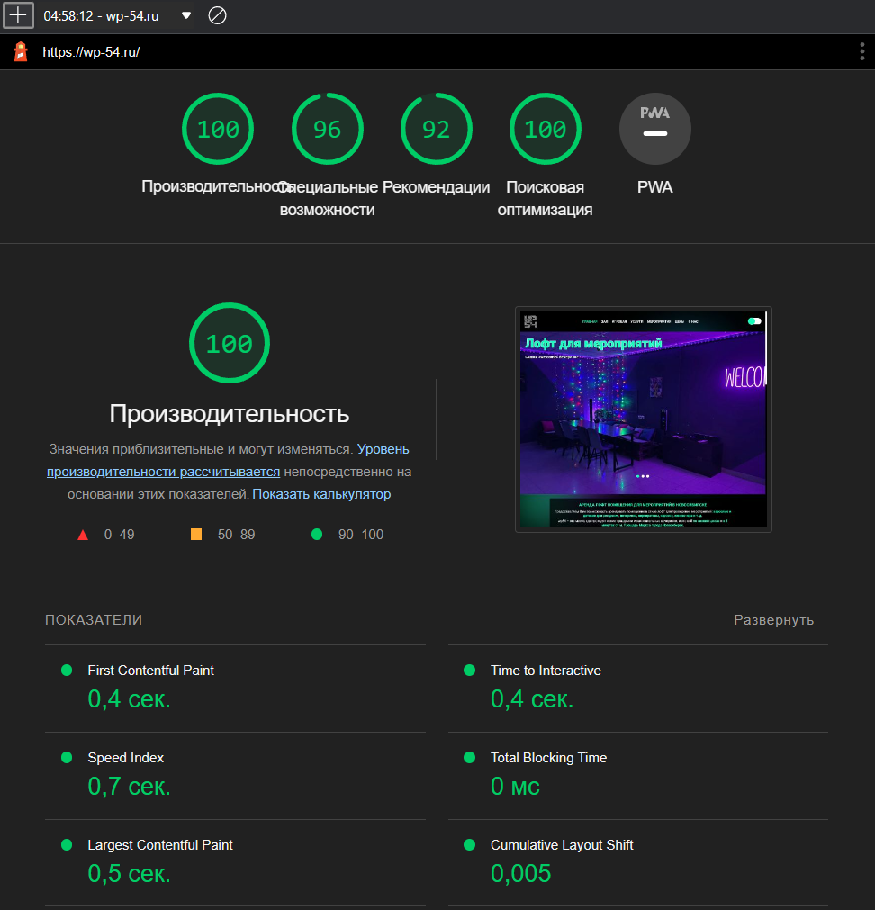

# wp54

Development of a website for the organization welcome_party54 for renting loft space in Novosibirsk. You can view the
site
by domain [wp-54.ru](https://wp-54.ru/).

# Description

The finished project is a multi-page website through which users can read all the necessary
information about renting a room and view its photos, and also have the opportunity to send a request for communication
or
go to social networks for further communication.

* This project was implemented using the programming language [TypeScript](https://www.typescriptlang.org/) libraries
  for creating user interfaces [React](https://reactjs.org/)
  and [Next.js](https://nextjs.org/)
* [MongoDB](https://www.mongodb.com/) is used as the database
* [Vercel](https://vercel.com//) is used to deploy the project
* Testing was performed using [Jest](https://jestjs.io/)
* Sending a request for communication was carried out using the [EmailJS](https://www.emailjs.com/) service
* The project uses [Yandex.Metrica](https://metrika.yandex.ru/welcome/)

# Installation and launch of the project

After cloning the repository, you need to install the packages, I used [npm](https://www.npmjs.com/)

```bash
npm install
```

Then you need to create an environment variables file **.env.local** in the root of the project

```
NEXT_PUBLIC_SERVICE_ID = "<serviceID from EmailJS>"
NEXT_PUBLIC_TEMPLATE_ID = "<templateID from EmailJS>"
NEXT_PUBLIC_PUBLIC_KEY = "<publicKey from EmailJS>"
```

You can learn more about the EmailJS service [here](https://www.emailjs.com/docs/sdk/send-form/).

To launch a project, use:

```bash
npm run dev
```

Open [http://localhost:3000](http://localhost:3000) with your browser to see the result.

To build a project, use:

```bash
npm run build
```

To start the project build, use:

```bash
npm run start
```

To run the tests, use:

```bash
npm run test
```

# Site Performance

* On mobile devices


* On desktop devices

