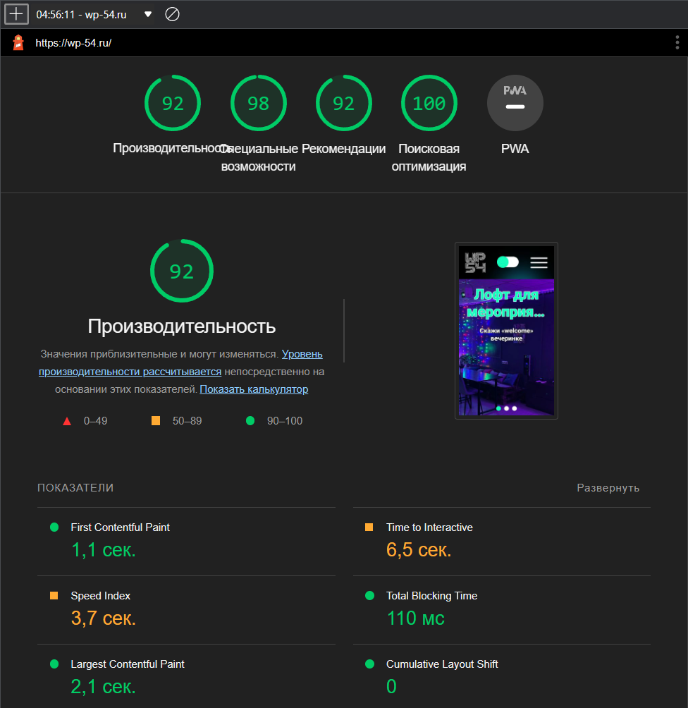
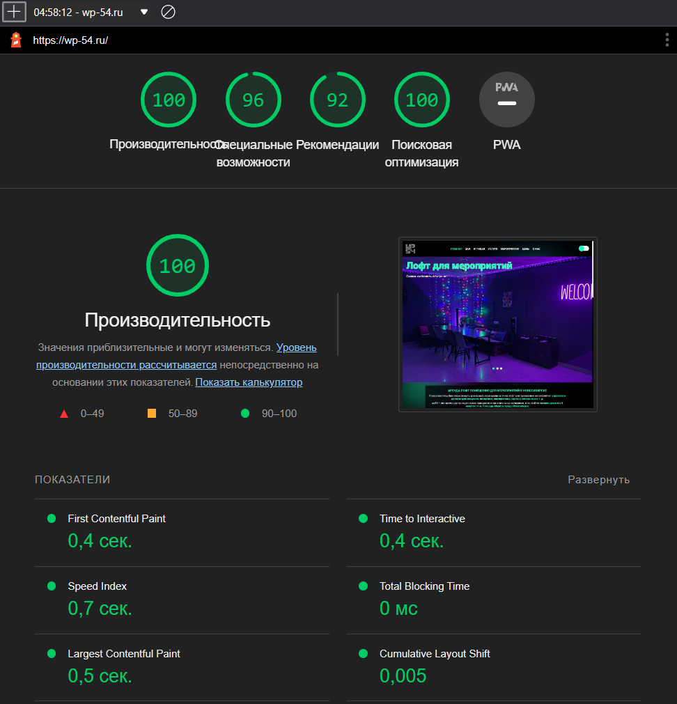

# wp54

Разработка сайта для организации welcome_party54 по сдачи в аренду лофт помещения в Новосибирске. Посмотреть сайт можно
по домену [wp-54.ru](https://wp-54.ru/).

# Описание

Готовый проект представляет собой многостраничный сайт, с помощью которого пользователи могут прочитать всю необходимую
информацию об аренде помещения и посмотреть его фотографии, а также имеют возможность отправить заявку для связи или
перейти в социальные сети для дальнейшего общения.

* Данный проект выполнен с помощью языка программирования [TypeScript](https://www.typescriptlang.org/) и библиотек
  создания пользовательских интерфейсов [React](https://reactjs.org/)
  и [Next.js](https://nextjs.org/)
* В качестве базы данных используется [MongoDB](https://www.mongodb.com/)
* Для
  развёртывания проекта используется [Vercel](https://vercel.com/)
* Тестирование выполнено с
  помощью [Jest](https://jestjs.io/)
* Отправка заявки для связи осуществлена с помощью сервиса [EmailJS](https://www.emailjs.com/)
* В проекте используется [Яндекс.Метрика](https://metrika.yandex.ru/welcome/)

# Установка и запуск проекта

После клонирования репозитория необходимо выполнить установку пакетов, я использовал [npm](https://www.npmjs.com/)

```bash
npm install
```

Затем необходимо создать файл переменных окружения **.env.local** в корне проекта

```
NEXT_PUBLIC_SERVICE_ID = "<serviceID из сервиса EmailJS>"
NEXT_PUBLIC_TEMPLATE_ID = "<templateID из сервиса EmailJS>"
NEXT_PUBLIC_PUBLIC_KEY = "<publicKey из сервиса EmailJS>"
```

Подробнее с сервисом EmailJS Вы можете ознакомиться [здесь](https://www.emailjs.com/docs/sdk/send-form/).

Для запуска проекта используется:

```bash
npm run dev
```

Откройте [http://localhost:3000](http://localhost:3000)  в своём браузере для локального просмотра.

Для сборки проекта используется:

```bash
npm run build
```

Для запуска сборки проекта используется:

```bash
npm run start
```

Для запуска тестов используется:

```bash
npm run test
```

# Производительность сайта

* На мобильных устройствах



* На ПК устройствах




